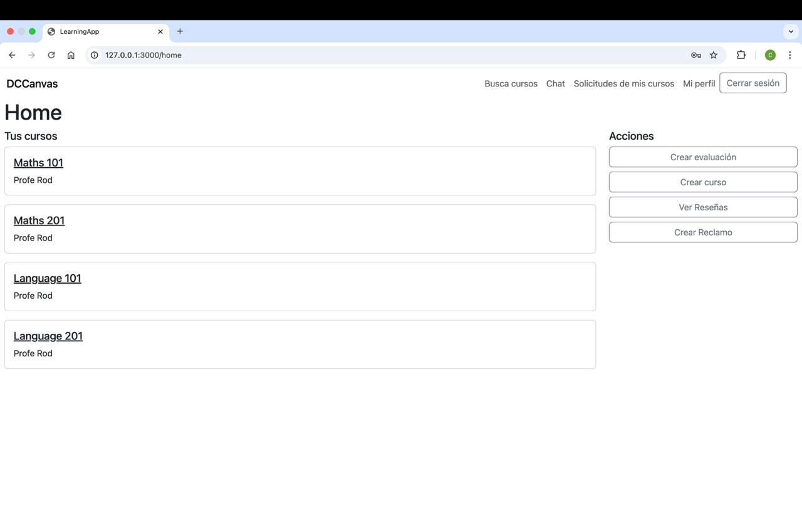
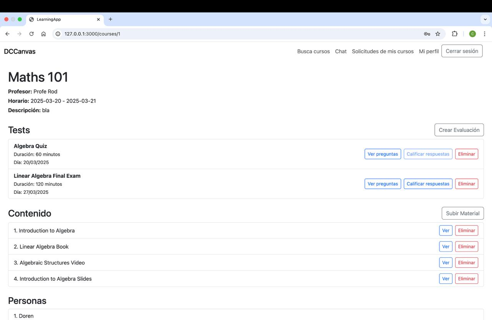

# 2024-2-grupo-61: DCCanvas

Proyecto del curso "Ingeniería de Software (iic2142)".
Plataforma de gestión de cursos: material, pruebas, alumnos, profesores. 

DCCanvas es una plataforma educativa diseñada para facilitar la interacción entre estudiantes y profesores. Permite gestionar cursos, evaluar a los alumnos y fomentar la comunicación en un entorno digital optimizado para el aprendizaje. Los profesores pueden crear y administrar cursos, calificar tareas y seguir el progreso de los estudiantes, mientras que estos tienen acceso a materiales de aprendizaje, foros y retroalimentación. La plataforma busca ofrecer una experiencia fluida y accesible para todos, mejorando tanto el proceso educativo como el rendimiento de los usuarios.

_

## Funcionalidades de la Página

### Funcionalidades Generales (disponibles para cualquier usuario):

1. *Buscar Cursos:* Los usuarios pueden explorar y ver el listado de cursos disponibles en la plataforma.
2. *Chats:* Pueden chatear con otros usuarios en la plataforma, con opciones de crear chats grupales o individuales.
3. *Perfil:* Cada usuario puede visualizar y gestionar su perfil personal, administrando su información de contacto y preferencias.

### Tipos de Usuario y Funcionalidades Específicas

#### 1. *Administrador:*
- *Gestión de Usuarios:* Puede gestionar la información de los usuarios registrados, incluyendo la edición de sus datos y la eliminación de cuentas.
- *Gestión de Reseñas:* Tiene la capacidad de administrar reseñas realizadas sobre los cursos y los profesores, con opción de eliminarlas si es necesario.
- *Gestión de Clases:* Puede crear nuevas clases y gestionar las existentes, incluyendo la adición, edición y visualización de material educativo.

#### 2. *Profesor:*
- *Creación y Gestión de Cursos:* Puede crear cursos y dentro de ellos gestionar evaluaciones, las cuales puede crear, calificar y eliminar una vez respondidas por los estudiantes.
- *Material de Curso:* Puede subir material educativo en distintos formatos (PDF, DOC, etc.), con la posibilidad de visualizarlo y eliminarlo.
- *Gestión de Solicitudes:* Puede administrar las solicitudes de inscripción a sus cursos, aprobando o rechazando a los estudiantes.
- *Reseñas:* Puede visualizar las reseñas realizadas sobre sus cursos y sobre él como profesor.
- *Cursos Dictados:* Puede ver y gestionar los cursos que está dictando.

#### 3. *Estudiante:*
- *Solicitud de Inscripción a Cursos:* Puede enviar solicitudes para inscribirse en cursos disponibles.
- *Reseñas:* Puede realizar reseñas sobre los profesores y los cursos en los que está inscrito.
- *Gestión de Cursos Inscritos:* Puede ver el listado de cursos en los que está inscrito, y dentro de cada curso:
  - Acceder a las evaluaciones y realizarlas.
  - Visualizar el contenido subido por el profesor.
  - Ver la lista de personas inscritas en el curso.

| Tipo de Usuario | Correo Electrónico       | Contraseña |
|------------------|--------------------------|------------|
| Estudiante       | student@student.com       | salero     |
| Profesor         | teacher@teacher.com       | salero     |
| Administrador    | admin@admin.com           | salero     |
_

## Instrucciones

### Para correrlo en local

1. Clonar el repositorio.
2. Instalar gems

bundle install

3. Crear la base de datos local, esta dependerá de la git branch en la que estás.

rails db:create
rails db:schema:load
rails db:seed

4. Para correr el servidor, se debe ejecutar

rails s

### Cada vez que trabajes en una *nueva* git branch
Si creas una branch para trabajar en algo que no utiliza base de datos, entonces esto lo puedes ignorar.

1. Crear branch

git checkout -b [new-branch-name]

2. Crear la base de datos específica para esa branch.

rails db:create

La configuración de la base de datos, config/database.yml, especifica que comando creará dos base de datos llamadas learning_app_development_[new-branch-name] y learning_app_test_[new-branch-name]. No podrás trabajar en esta branch si no creas esta base de datos específica. Rails sabrá cuál usar.

3. Cargar el modelo previo con los datos necesarios.

rails db:schema:load
rails db:seed

4. Una vez finalizado el uso de la branch, con sus cambios merged a la branch development, eliminar la base de datos.

rails db:drop

5. Además, eliminar la branch. Github permite eliminarla por la página. O, se puede hacer:

git branch -d [branch-name-to-delete]

Una vez merged, no utilizar de nuevo la branch, siempre borrarla.

### Cada vez que vayas a programar

1. Actualizar branch en la que se va a trabajar.

git checkout [work-branch]
git pull

2. Asegurarse de que no hayan cambios en el modelo.

rails db:migrate:status

Si hay alguna migración que no ha sido corrida, rails no permitirá correr la aplicación. Migramos la base de datos:

rails db:migrate

3. programar
4. Realizar commits de los cambios, idealmente lo más granular posibles. Commits con cambios pequeños, graduales y funcionales. *Que el mensaje continue la frase "if applied, this commit will ..."*. Por lo tanto, el mensaje comienza con un verbo y debe ser descriptivo. Uno debe poder leer el mensaje 6 meses después y acordarse qué hizo. https://www.freecodecamp.org/news/how-to-write-better-git-commit-messages/
5. Subir los cambios al origen. git push

### Para correr las tests

Para correr los tests de la aplicación

rails test

Utilizamos SimpleCov para analizar la cobertura de código. Sin embargo, existe una [falla en SimpleCov que no permite correr en tests paralelo y dar resultados correctos](https://github.com/simplecov-ruby/simplecov/issues/718#issuecomment-538201587). Por lo tanto, desabilitamos el coverage por defecto. Con todo esto, si quieres analizar la cobertura de código, corre el comando:

COVERAGE=1 rails test

Esto habilitará SimpleCov y la configuración necesaria para que la cobertura funcione correctamente en paralelo.
